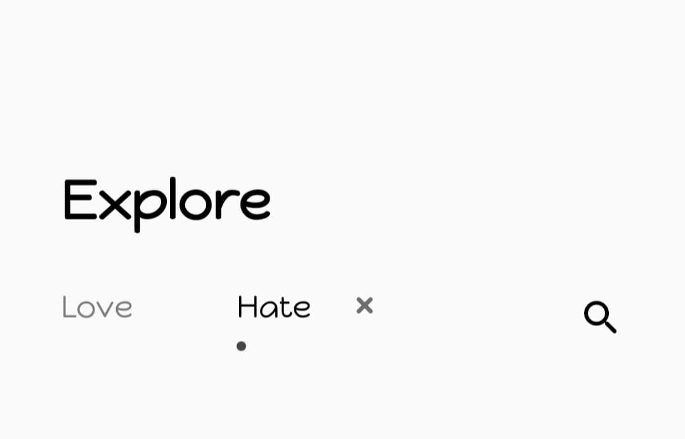
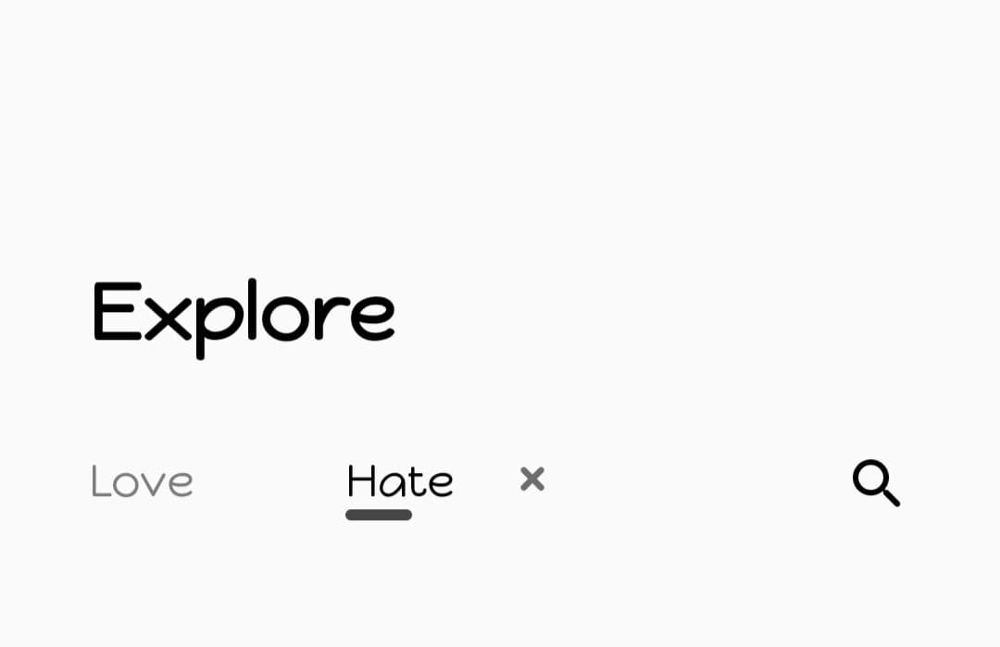
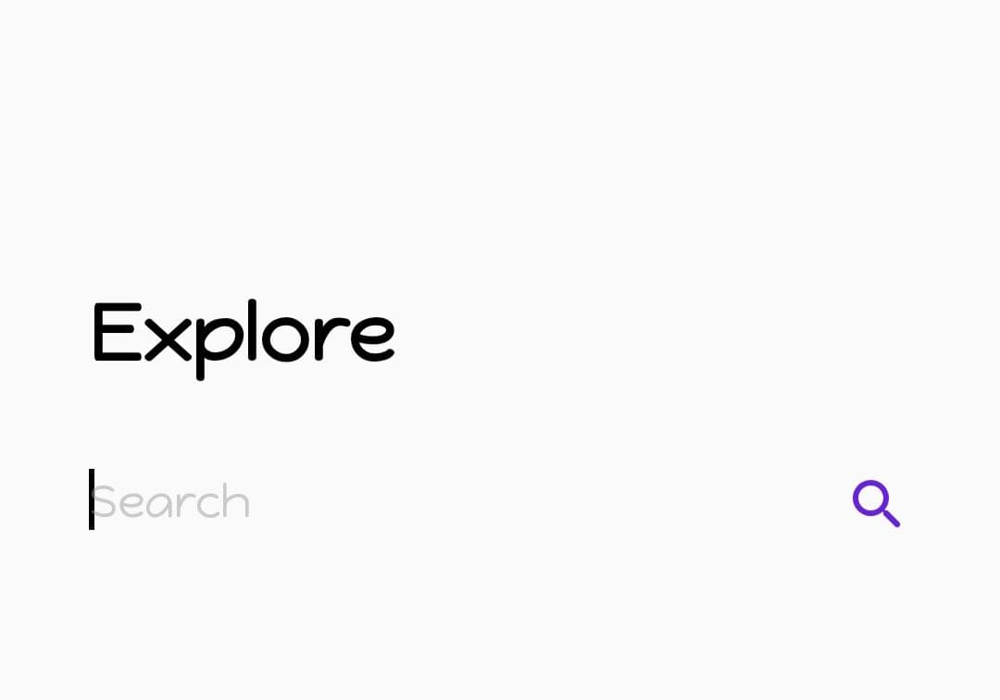
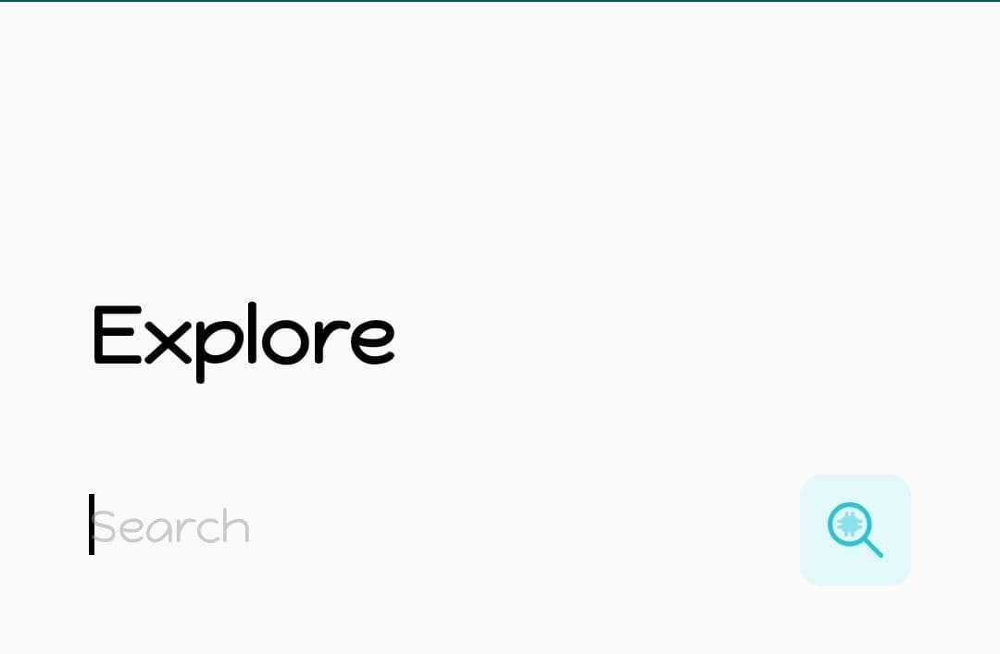

# MultiSearchView
Yet another built-in animated search view for Android. 

All design credits goes to [Cuberto](https://dribbble.com/cuberto) And inspired from [this design](https://dribbble.com/shots/5922034-Multi-search-by-categories)


## Video demo
[Here](https://www.youtube.com/watch?v=p1HQkgMCpl8)

## Setup
```gradle
allprojects {
    repositories {
        ...
        maven { url 'https://jitpack.io' }
    }
}

dependencies {
    implementation 'com.github.iammert:MultiSearchView:0.3'
}
```

## Usage

```xml
<com.iammert.library.ui.multisearchviewlib.MultiSearchView
        android:layout_width="match_parent"
        android:layout_height="wrap_content"/>     
```

```kotlin
multiSearchView.setSearchViewListener(object : MultiSearchView.MultiSearchViewListener{
    override fun onItemSelected(index: Int, s: CharSequence) {
    }

    override fun onTextChanged(index: Int, s: CharSequence) {
    }

    override fun onSearchComplete(index: Int, s: CharSequence) {
    }

    override fun onSearchItemRemoved(index: Int) {
    }

})
```

## Customize
If you need customize MultiSearchView, firstly you should add style set under styles.xml
```xml
     <!-- Search Text Style. -->
    <style name="SearchTextStyle">
        <!-- Custom values write to here for SearchEditText. -->
        <item name="android:focusable">true</item>
        <item name="android:focusableInTouchMode">true</item>
        <item name="android:enabled">true</item>
        <item name="android:hint">Search</item>
        <item name="android:imeOptions">actionSearch</item>
        <item name="android:textSize">18sp</item>
        <item name="android:maxLength">15</item>
        <item name="android:inputType">textCapSentences</item>
        <item name="android:textColorHint">#80999999</item>
        <item name="android:textColor">#000</item>
    </style>
```

Thereafter, you should give style set to app:searchTextStyle under MultiSearchView
```xml
        <com.iammert.library.ui.multisearchviewlib.MultiSearchView
            android:id="@+id/multiSearchView"
            android:layout_width="match_parent"
            android:layout_height="wrap_content"
            android:layout_marginTop="16dp"
            app:searchTextStyle="@style/SearchTextStyle" />
```

That's it. You created own style for MultiSearchView


#### Change selected tab style
There are currently two styles available. The `dot` style and the `line` style

```xml
	app:selectedTabStyle="dot"
```



```xml
	app:selectedTabStyle="line"
```


#### Change default search icon color

NB: Changing the search icon's color works best when it is applied to the default icon

- Put the color you want to set to the icon in your `colors.xml` file

  ```xml
  <color name="custom_purple">#6621E1</color>
  ```

- Then add the `searchIconColor` xml attribute to change the icon's color

    

```xml
   <com.iammert.library.ui.multisearchviewlib.MultiSearchView
          android:layout_width="match_parent"
          android:layout_height="wrap_content"
          app:searchIconColor="@color/custom_purple"/>
```

#### Change search icon
- xml



```xml
<com.iammert.library.ui.multisearchviewlib.MultiSearchView
        android:layout_width="match_parent"
        android:layout_height="wrap_content"
        app:searchIcon="@drawable/ic_search"/>
```


# Thanks to contributers

* [Mert Ceyhan](https://github.com/mertceyhan)

License
--------


    Copyright 2019 Mert Şimşek
    
    Licensed under the Apache License, Version 2.0 (the "License");
    you may not use this file except in compliance with the License.
    You may obtain a copy of the License at
    
       http://www.apache.org/licenses/LICENSE-2.0
    
    Unless required by applicable law or agreed to in writing, software
    distributed under the License is distributed on an "AS IS" BASIS,
    WITHOUT WARRANTIES OR CONDITIONS OF ANY KIND, either express or implied.
    See the License for the specific language governing permissions and
    limitations under the License.

